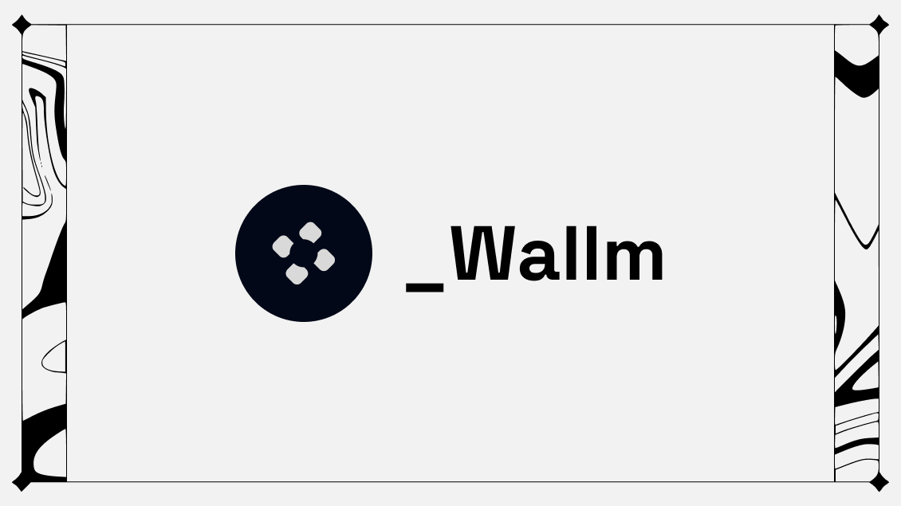

# _Walln



An LLM-powered chat to simplify your wallet interactions with a unique credit system.

## How to run

### Smart Contracts

1. Install dependencies:
   ```bash
   pnpm install
   ```

2. Compile the contracts:
   ```bash
   npx hardhat compile
   ```

3. Run tests:
   ```bash
   forge test
   ```

4. Deploy contracts:
   ```bash
   npx hardhat deploy --network <network-name>
   ```
   Replace `<network-name>` with the desired network (e.g., localhost, goerli, mainnet).

### Frontend App

1. Navigate to the app directory:
   ```bash
   cd app
   ```

2. Install dependencies:
   ```bash
   pnpm install
   ```

3. Run the development server:
   ```bash
   pnpm run dev
   ```

4. Open [http://localhost:3000](http://localhost:3000) with your browser to see the result.

## Testing

### Smart Contracts

Run the test suite using Forge:

```bash
forge test
```
For more detailed output, you can use:

```bash
forge test --vvvv
```
